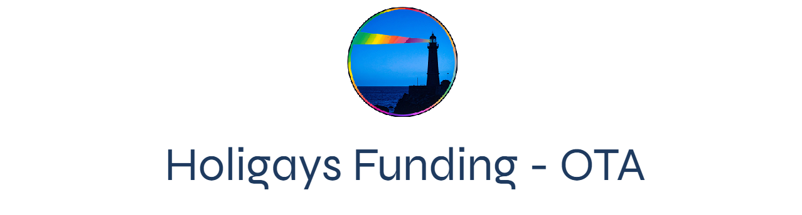
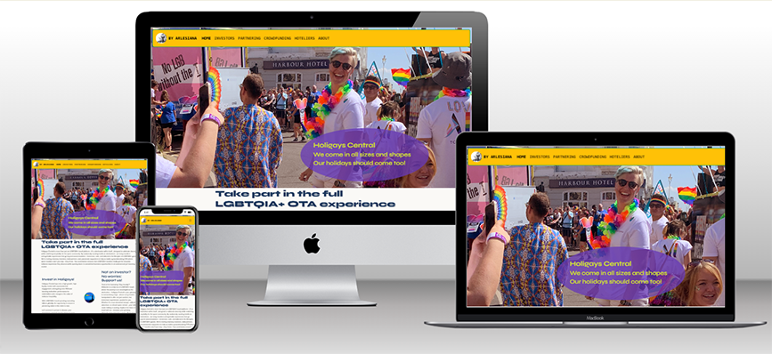

Deployed at https://pedros-studies.github.io/Holigays_funding/

Repository at https://github.com/PedroS-Studies/Holigays_funding

Sandbox project for hotel as destination OTA 

# Table of Content

## User Experience and user stories
[Download full UX including user stories](user_experience_user_stories.pdf)

### Strategy
This project is developped as a Sandbox for a general OTA (Online Travel Agency) project for Hotel-as-destination with unlimited number of niches.

### Scope
This first module of the sandbox is the fundraising website of Holigays Central. It is promoted under the umbrella of Arlesiana Ltd, which promotes long-tail marketing projects in hospitality. 
The users of the website are expected to be 
- Investors
- Interested partners
- Prospective individual customers
- Hoteliers, existing or prospective, interested either in the concept of LGBTQIA+ hotel or an OTA pandering these services.

The Investors and possible Partners are targeted as one group with unified users. They will be offered an immediate access to appointment in exchange of their information including professional validation details.

The prospective customers will be offered three levels of involvment:
- Registration of interest (Newsletter)
- Show of sympathy - "buy me a coffee", still a show of interest.
- Possibility to crowdfund the project
As of today, this is mainly to measure the interest of the possible customerbase in the product.

The Gay hoteliers, existing or prospective aren't currently targeted by the project. The situation nowadays, with destination-first mentality, is that even co-called gay-destinations have so few exclusively LGBTQIA+ structures that the owners have all the interest in bringing the guests to their own website and avoiding to have to pay commissions to OTA's.

However, the current trend is toward guests booking the "hotel as detination". This will not only promote the specific search engines telling the customers where to find a hotel for "rainbow family", "Gaymers" or "Gay golfers", being the destinations riding the segment of LGBTQIA+  increasingly attractive for tourism. The Niche-specificity will be a defining factor.

The sub-niches of "LGBTQIA+" category are sufficiently limited, labelled and controlled as branding to serve as sandbox for a wider Niche-related OTA project, with more complex features in the management of an unlimited and ever-increasing roster of niches. 

Currently, the mainstream OTA's, such as booking.com or hotels.com provide at the best the category of "Gay-friendly".

Ideally the project developped in this sandbox will eventually become part of this wider Niche-related, Hotel-as-destination OTA, or should it have success as independent interface, it could still profit from the engine of the wider project as SaaS.

### User Stories

* LGBTQIA+ Traveller User needs a way to get informed of the existence of the project and register so that they can follow.
* LGBTQIA+ Traveller User needs a way to show support for the initiative so that they can donate.
* Investor Users need a way to book an appointment so that they can meet and get pitched.
* Prospective hotelier Users need a way to receive information about hotels of this niche so that they can prepare for what is coming their way.
* Abusive users, trolls and haters should not have an easy access to any interactive feature enabling to saturate the server or the services.

### Pages

In light of the user stories, it seems that the minimum viable version of the website should have the following pages, of which at least three potential landing pages, once the project includes a SEO phase.

- Index.html
- Investors and partnerships landing page
- Prospective customer landing page with external links to 'Crowdfunding' and 'buy me a coffee' and link to
- About page
- Information for hoteliers
- 404 page

This pages roster also includes secondary user-specific features as well as protection features for unwanted users.

### Design choices

#### Fonts
The basic choice for bespoke as well as for the browser default fonts are Sans-Serif fonts:
- Syne
- Syne-mono
- IBM Plex Sans

|Syne|Syne Mono|IBM Plex Sans|
|:----|:----------:|---------:|
|The stylistically defining font used for the website is Syne. Its whimsical and elegant, though simple styling asserts a corporate message conform with the common Pride Slogan "We are Queer and we are here!". Mostly this font appears as cobalt blue #1E3A5F in headers 1-6, in a smooth contrast with the off-white background.|Some interactive elements use a more aggressive version of Syne, Syne Mono, to give a sense of action. This is mostly used in hyperlinks, among others in the NavBar.|The main content is rendered in a tame, neutral and corporately acceptable sans-serif font of IBM Plex sans, for a smooth reading.|
|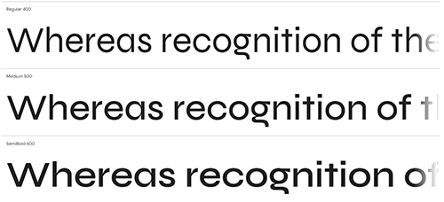|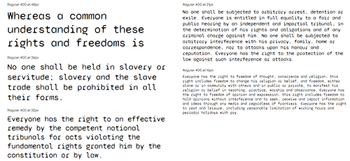||

#### Icons
Icons linked from FontAwesome library

#### Images
Logotype use Arlesiana logo (black and white) contrast with Holigay swatch. The click on logo takes you to Arlesiana website.
Hero-image of own copyright from Brighton Pride.
Other assets from fee-of-charge stock

#### Branding and Swatches
Background: Off-white, Colour swatch from basic colours as used in the official LGBTQ banner – not extended banners.
Font-colour picked from hero picture. CTA colour scheme to be taken from swatch.
Not yet Holigays-specific final branding (leave open for investors or partners) or logos. Use generic LGBTQAI+ related branding to not commit too early. Use very light neutral colour filter on assets to simulate uniform branding possibly “Tekhelet” (#075299) or “Egyptian Gold” (#E7C38A).
Provisory Branding including graphics and mockup logo are based on the LGBTQIA+ rainbow flag. Text and font elements are compatible with a limited swatch:

### Wireframes

#### General responsiveness

The responsive design is quite consistent over the project. It involves a mix of Bootstrap grid for the more complex features, often containing up to 4 breakpoints, and standard flexbox, mostly when only two breakpoints are involved. The page containing most of the features is the index.html whose responsiveness from smallest media to largest should flow according to this wireframe:

|Purpose and project|wireframe|
|:-------------------|:---------:|
|*ORIGINAL PROJECT NOTES:* General responsiveness from smallest to widest viewport. Footer not yet defined. Will probably be about the hosting platform Arlesiana. - Will use flexbox and some Bootstrap - Bootstrap grid for the articles - Bootstrap navbar - overriding most of it with own css, though.|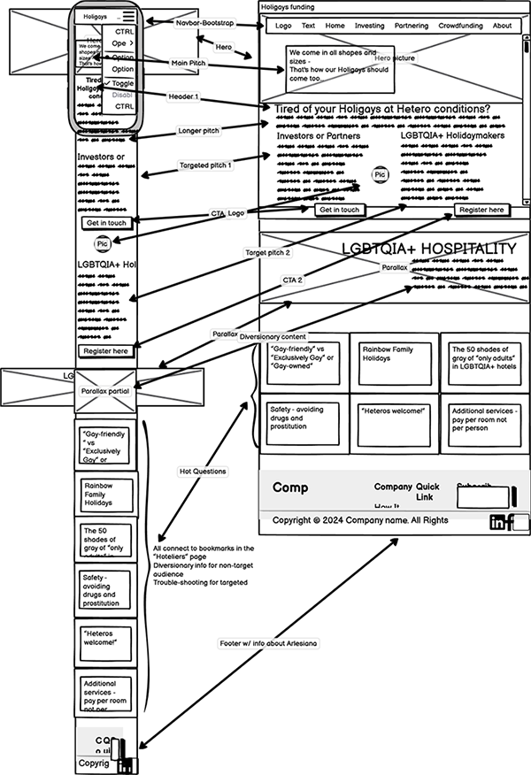|

The other pages would follow the general pattern of the Hompepage layout-wise, limiting the rendering in two columns, which would stack one above the other in smaller wiewports. 

#### Homepage

|Purpose and project|wireframe|
|:-------------------|:---------:|
|*ORIGINAL PROJECT NOTES:*  General layout of index/home page. The content cards <in the Bootstrap grid will link to particular bookmarked sections in the <hoteliers page and - apart distracting the not-targeted audience - will possibly also cater to some of the principal questions of the investors.|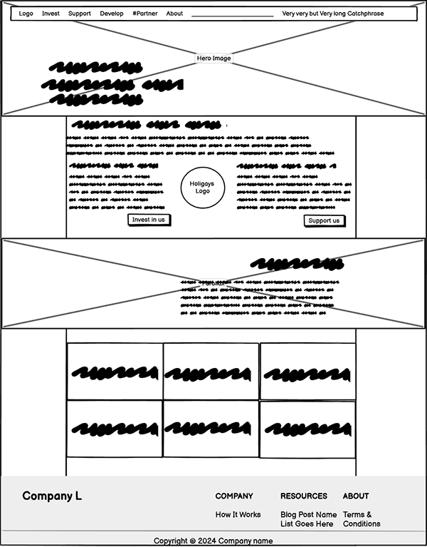|

#### Investors and partners page

|Purpose and project|wireframe|
|:-------------------|:---------:|
|*ORIGINAL PROJECT NOTES:*  Main expectation is that possible investors take an appointment with the cal.com embed. There will be possibly a short elevator pitch in the video to help the investors to get an idea of my voice and face.   The partnership section below is the part to which the "partner with us" link of the navbar will be pointing to.|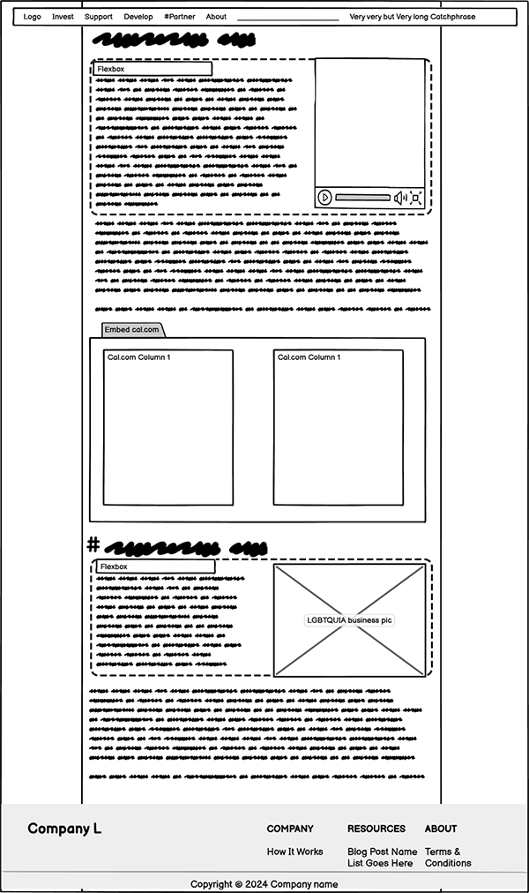|

#### End-user page

|Purpose and project|wireframe|
|:-------------------|:---------:|
|*ORIGINAL PROJECT NOTES:*  The purpose of the page is to collect information about the engagement and the level of engagement of the expected end-users. To that end, there will be three CTA's: - A link to a crowdfunding page - A widget of "buy me a coffee" - A link to form/mailchimp for inscription to a newsletter. The assets to target more the consumers rather than stakeholders.|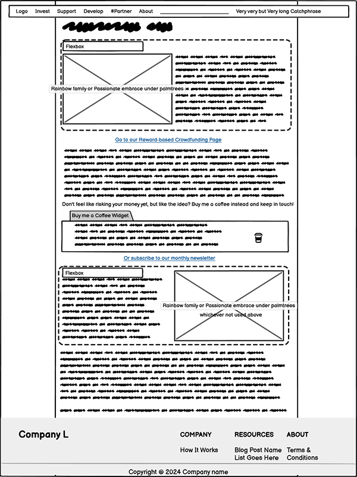|

#### Hotel-owners page

|Purpose and project|wireframe|
|:-------------------|:---------:|
|*ORIGINAL PROJECT NOTES:*  The purpose of the page is to make the existing or prospective hoteliers knowledgeable about the  existence of the project. The hoteliers aren't yet targeted since the questions of their interests depend of the feedback by investors and responsiveness of possible end-users.   However, some topics within should also answer doubts and questions of the stakeholders.|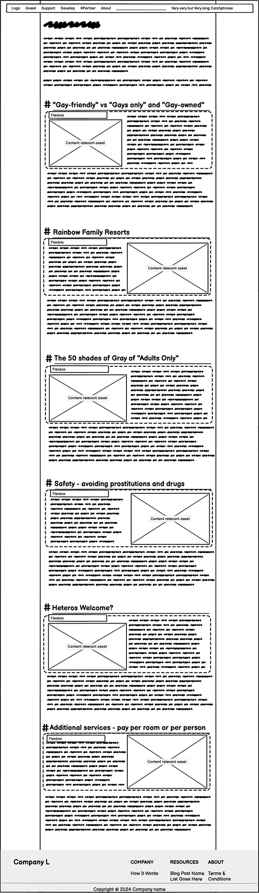|

#### About the project page

|Purpose and project|wireframe|
|:-------------------|:---------:|
|*ORIGINAL PROJECT NOTES:*  A short paragraph of informtion about the timeline and dependencies of the project as well as link to future showcase on LinkedIn. Short summary of the project director,  and some links to connect.    *ABOUT THE IMPLEMENTATION:* Originally the project contemplated adding a short video presentation of the project and of the project manager, to familiarise the possible investor or partner about the voice and aspect of the interlocutor. However, since it would not be possible to embed a video player and including a Youtube or Vimeo video was considered counterproductive, a brief description of the USP's was considered more adequate.   This is the most important variation of the final implementation regarding the original project|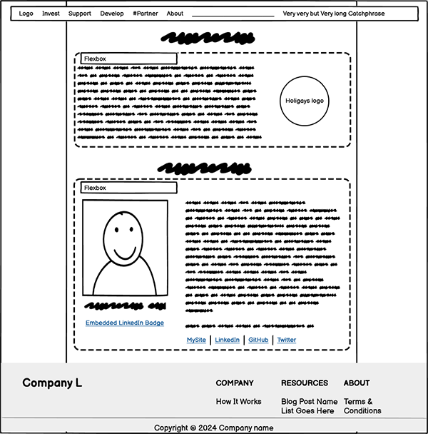|

#### 404-page

The 404 page was originally designed to just contain the short message about the issue, with the general NavBar allowing a way out to any other page. 

However, with time, it was considered reasonable to allow the user to report the issue, with most basic user form, projected to be a unique stack of 4 fields of data entry, all of the same size, stacked one on top of the other. Later the idea evolved to include general contact features to allow a hater-safe way of contacting the project management. 

Generally speaking, the final coding corresponds mostly to the projected wireframes. Most changes correspond to giving the pages breathing space for an easier reading, including decorative assets, with no other purpose than providing negative space.

<!-- Paste FEATURES section from here -->
## Features

### Global Features

The intended global features in interface relate to safety, interactivity and accessibility to encourage engagement by the main categories of users. 

#### Safety Features - general sentiment

The implemented safety features aim to reduce the vulnerability of any LGBTQIA+ related website from trolls and haters - unwanted users. 

The footer of all pages features a link to “contact us”. This link is intentionally broken. In this way any ill-intentioned user aiming to cause a maximum of offense in a minimum of time, will probably just move on, trusting the form below to be to report bugs to a webmaster. A possible frustrated and well-intentioned person intending to communicate in good faith, will hopefully investigate the very simple form further and notice that the “subject” dropdown menu also contains choices for contact request and feedback.

To further complicate the submission of form information by bots, the submission of the dataset requires the solving of a Google reCAPTCHA v. 2

Should an unwanted user otherwise wish to interact with the website, this would entail either the payment of an amount, with disclosure of credit card details, or a major commitment in time and information beyond a quick insult, making the trolling operation not worth the time required.

Except for the LinkedIn information – showcases and the Project Manager’s profile – no information on social media is provided.

Until the final deployment of the pages is programmed and further safety features, including backend, are implemented, the content for robots-metatags is declared as “nofollow”, “noindex”, SEO-wise.

#### Interactive features 

The interface encourages the well-intentioned users to actively engage with the different CTA’s. Whenever possible, a hyperlink in shape of a button is preferred to a textual one. 

A Cal.com widget allowing the possible investors or aspiring partners to book an in-person appointment with the Project Manager. Extended verification information, including corporate is required for the reservation. However, the user comes out of the experience with a booked reservation. 

In the public version of the website, a resolved end-user of the website and the possible final product, can take the step and become stakeholder of the project with a reward-based crowdfunding. 

Since most non-corporate users won’t be motivated to donate their monies to a supposedly precarious project, the opportunity will be given them to show their solidarity with a modest amount with the “Buy me a Coffee” widget.

For the most common user curious of the project as final consumer the most likely – and most expected – action will be the subscription to a possible future newsletter with updates on the project, should it take off.

The non-corporate user interactions are intended mostly to serve for metrics in market research.

The most discouraged interactive element available for the good-faith user is the contact us form, hidden in the 404 page.

#### Accessibility features

The interface implements accesskeys for the Navigation features on the homepage and the form on 404 page. The accesskey shortcuts will be complemented by aria-labels to ease voice-assisted navigation.

All the assets have alt-text attributes

Aria-labels are implemented, whenever possible, to ease navigation.

Aria-describedby labels are implemented, wherever convenient, to lighten the task of the screenreaders, among others, in the hero-image of the homepage, where the image is set up in css.

#### Non-UX related Marketing features

##### SEO

The final Search Engine Optimisation of the website relies mostly on the descriptive text in the headers 1-3. However, some metatags have been included to widen the scope of the indexing. 

###### Metatags

The tags "LGBTQ, rainbow family, gay holidays, holigays, gays only, gay owned, funding, investment" appear on all pages.

However, some pages have bespoke tags relating to their content, to help Search Engines to consider them as possible landing pages.

The 404 page and Buy me a Coffee widget containing page don’t have any tags.

Since some features of the pages need further protection before being implemented publicly, currently all pages come with “nofollow” and “noindex” robots-tags.

##### Customerbase demographics

A significant number of assets represent predominantly female agency and empowerment in the community, since they are demographically considered decision-makers and generally more influential for buying in the LGBTQIA+ community. Male representation is intentionally reduced to social, reassuring and family-related aspects, to contrast with the common stereotypes about gender defined behaviours.

### Shared features

#### Navbar

The navigation bar at the top of the viewport is a floating Bootstrap navbar which remains visible during the navigation. The colours have been taken from the expanded rainbow swatch connected to the provisory Holigays logo, rather than the more sober general UI swatch for fonts and lesser graphic elements.

The NavBar prominently contains the logo of Arlesiana Ltd, the Umbrella company promoting Holigays and other OTA'S, contrasts in its sobriety of black and white with the garishness of the provisory logo of Holigays. 

It also contains the links to the main pages of the site. The link for "partners" lead to a bookmark on the "investors" page. All links are assisted by aria-labels and accesskeys

The final version of the website will also probably include a commercial tagline about the project, since the location on the page is prime real estate marketing-wise. The tagline is currently commented out.

The element containing responsive Bootstrap framework element includes automatic resizing for handheld devices, prominently a stack menu button

The NavBar uses as font the Google font IBM Plex Sans, with alternative of sans-serif and an 1.2 x enhanced size to facilitate the visualisation for a more accessible experience. 

All the links to existing pages include "disabled" as class and "aria-current" for the active page, with the exception of 
- Partners link which points to a bookmark in the investors page, and which would be useful to have active in case somebody on the same page wanted to jump to the bookmark.
- 404 page: this page obviously doesn't appear in the NavBar.

#### Footer

The footer, present on every page, contains corporate information for both Arlesiana Ltd and Holigays Central Ltd, and links to further information about the companies and the projects online, on LinkedIn and on GitHub.

It also contains an intentionally broken link to an inexistent page “contact.html”, to trigger the 404 page, which contains the apparently webmaster-related form, but which also allows to send contact requests and feedback.

The styling of the footer duplicates the styling of the NavBar and also contains a Bootstrap grid structure for responsiveness.

### Pages

#### Home

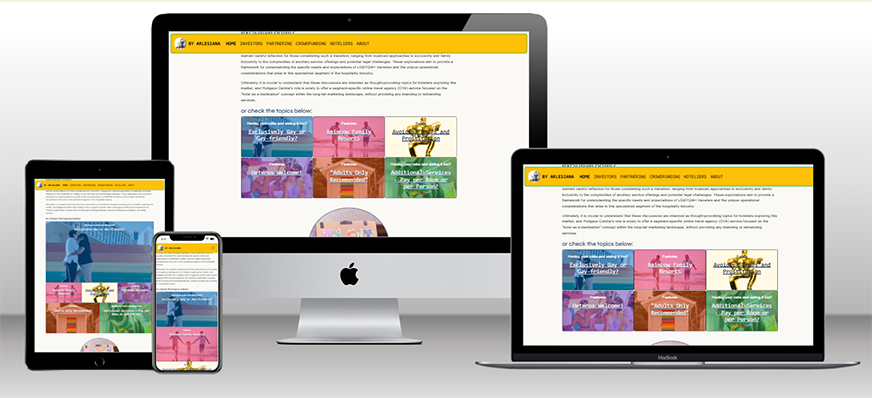

The Hero image has been taken during the Brighton Gay Pride of 2022 and feature three women of very different aspects to link with the main text of the overlaid text. The picture automatically crops itself in decreasing viewport, and the shape of the overlaying textbox changes according to the size and re-orientation of the hero-picture from landscape to portrait. 

|Page layout priorities|.|
|----------------------|:--------------------------------------:|
|The Homepage has a traditional F-shape hierarchy of importance, with the most important information on the top-left. The first two text blocks address both main User groups, the investors and plausible crowdfunders, with a CTA for each, leading to relevant information pages. The choice of buttons instead of text, is a deliberate to anticipate for the user that this is part of an action which will culminate on the next page. Between the blocks features prominently a provisory logo for the project, based on a rainbow swatch. The colour swatch of the logo is later repeated as filters on different assets of the site. Below on the page, there is seemingly a profuse amount of information for the secondary users of the website, the hoteliers. The main link for the page, also present in the navbar, leads to the hoteliers’ information page. A mosaic of images, incorporating links on an overlay, lead to bookmarks of the different sections of the hoteliers’ page, giving the appearance of an abundance of wiki.  The images used for the mosaic are mostly photographs with coloured overlays, except for the potentially most controversial issue regarding hotels based on sexual identity, Prostitution. The theme is very likely the elephant in the room every time the niche is discussed and the section of the mosaic calls attention to it, not only for being a designed graphic, but also for being an animated gif. Contrary to the other assets on the page, the animated gif is not duplicated on the Hoteliers’ page but is substituted by a photographic picture. |  |

Apart from the hero image, the page also includes inspiring assets for the sake of the layout to create negative space making the reading easier.

#### Investors and partners

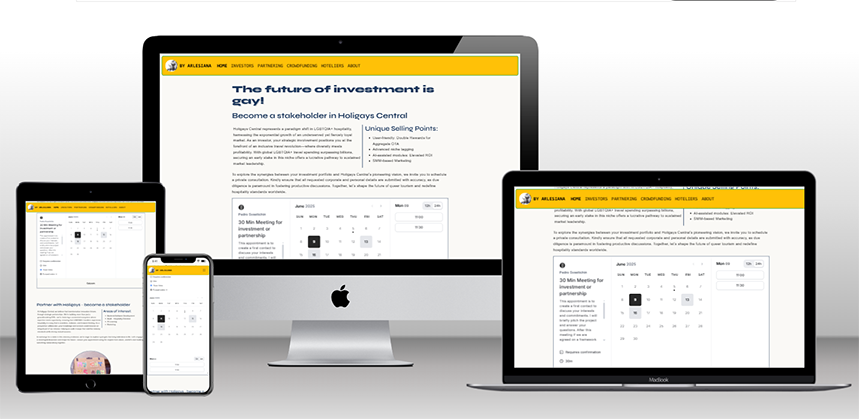

The page targets mainly investors, who have a dedicated section with a sales pitch and a list of main elements of the USP, but also opens up to corporate cooperation for companies wishing to partner against a participation in the project

The focal point of the page is the interactive cal.com widget located between the investors and partnering sections. This widget allows to book a meeting directly from the Project Manager's calendar.

The page is intentionally frugal and essential to be taken in in a minimal lapse of time and inviting to a spontaneous reaction to the CTA. 

#### Crowdfunding

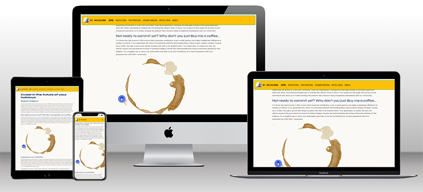

Contrary to the aspiration of the investors page to act immediately, the page targeting the non-corporate users aims to provoke pondered choices of commitment at different levels of involvement and sentiment from the possible future users of the product. The importance is more on the market research aspect of gauging the level of interest of the users than collecting donations.

1/ The highest level of involvement is the possibility to become a full-pledged stakeholder by engaging in rewards-based crowdfunding.

2/ The secondary option is to show sympathy for the initiative by donating a token amount to the project manager through "Buy me a coffee". 

Since the widget normally presents itself as a very inconspicuous icon on the bottom-right corner of the viewport, an embedded iframe containing an ancillary page featuring the widget was added, to present it more prominently on the main page.

3/ The weakest option for the non-corporate user is to subscribe to a future newsletter, in case the project takes off. The subscription still shows a level of commitment for the reader to have red the information in a fairly loaded page.

Originally, a direct feedback form was considered, but the idea was later discarded for the element easily becoming a vulnerable to trolls and haters.

#### Hoteliers

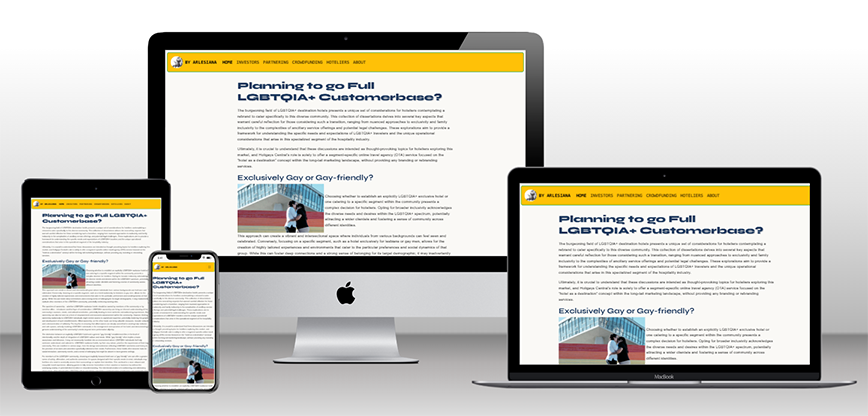

The page contains 6 articles for the consideration of hoteliers, who are possibly already managing a LGBTQIA+ niche hotel or who might be considering rebranding in the niche. Each article is accompanied by an asset with a filter repeating the colour swatch of the mock-up logo.

The purpose of the page is to raise interest in the hoteliers to possibly return on the website to check the progress of the project. Consequently, the lack of any specific CTA's or interactive elements for this user group is intentional in this phase.

#### About

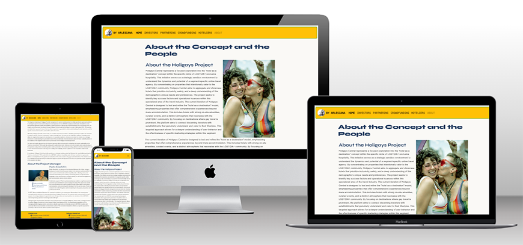

The page gives an overview of the project, and it also features a personal summary of the Project Manager, as well as a link to his LinkedIn profile.

The project overview is accompanied by a strong impact picture, letting the user understand that the project is related to a niche of adult sexual identity related hospitality. This highlights the fact that the acceptance of any commitment has moral repercussions beyond a simple DEI statement.

#### 404 page

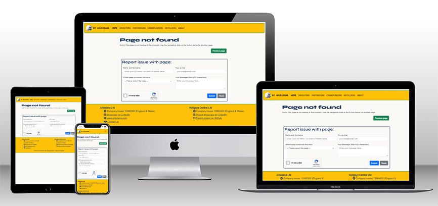

The "Contact us" broken link in the footer located on every page deliberately leads here. It is expected that should a troll or hater land on this page, without further thinking, they will associate the form as one used to report bugs to a webmaster, and they will move on. 

A button for navigating back to the previous page in history figures prominently under the error message.

However, it is to be expected, that a person with a serious motive to communicate will take the time to investigate the few fields of the form and find the options for "contact us" or "give feedback" in the dropdown menu.

The idea isn't completely foolproof, but the reCAPTCHA on the page should thwart repeated attacks by trolls and bots.

### Future Features

The security features will be further enhanced with reCAPTCHA double-check and IP harvesting in the form on 404, when a backend will be implementable. The APIs are currently vulnerable. 

Most of the external links currently lead to dummy pages. However, they will link to the adequate pages, once the project takes off. 

Some pictures feature vulnerable subjects - this being another reason for the “nofollow” and “noindex” metatags in SEO status. When the site goes public, the faces of said subjects will be morphed, rather than blurred.

Accessibility features will be improved with further testing among others with Lynx browser and screen readers, and a high-contrast version, to comply with WACG guidelines. A full accessibility guide page will be included in the final version.

Should the project take off, the website will be hosted on sub web of Arlesiana Ltd's website.

<!-- End FEATURES SECTION -->
## Technologies used
HTML
CSS
Frameworks and libraris:
- Bootstrap
- Google Fonts
- FontAwesome

## Tools

### IDE

Microsoft's VS Code was the main IDE during the coding of the website.

### Versions Control

GitHub has been the only interface of versions control, throughout the project.

### Project Management

Initially, the project was planned with MS Project, which relies on Gantt charts for tracking of the tasks. However, considering the didactic requirements of the milestone project, by the launch of the coding, GitHub projects was used, since it allowed a major connection with the versions control. However, Kanban-based project management tools, notwithstanding their ease of use and adaptability to teamwork, are more time-consuming and less performant in tracking the tasks.

### Assets Editors

Adobe Photoshop 2025

Adobe Lightroom Classic 2025

TechSini Multi Device Website Mockup Generator

### Wireframes

Balsamiq

### Assets Management

Considering the elevated number of assets and their backups, Adobe Bridge was used to file, tag and keyword editing. Multiple changes to assets actually stem from the update of the tags.

## Testing

See [TESTING.md](TESTING.md)

## Deployment
Deployed at https://pedros-studies.github.io/Holigays_funding/

## Credits
Adobe Stock
UnSplash
Adobe Firefly

### Content
Content has been generated with Google Gemini Flash 2.0

