#Testing and accessibility

## Code testing

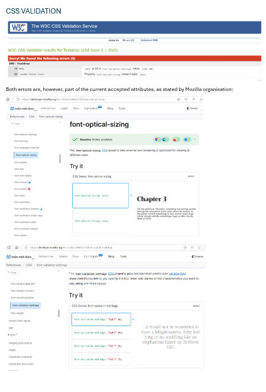
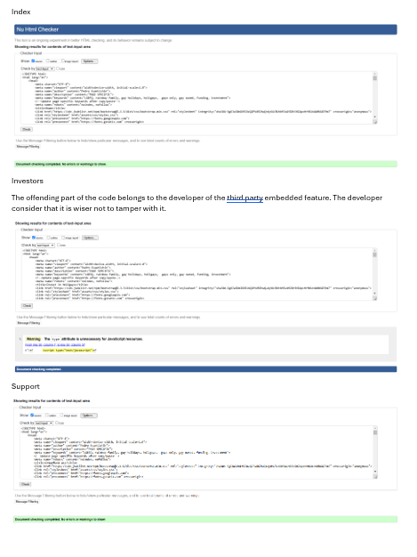
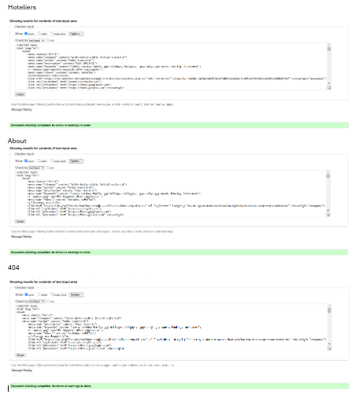

## CSS testing

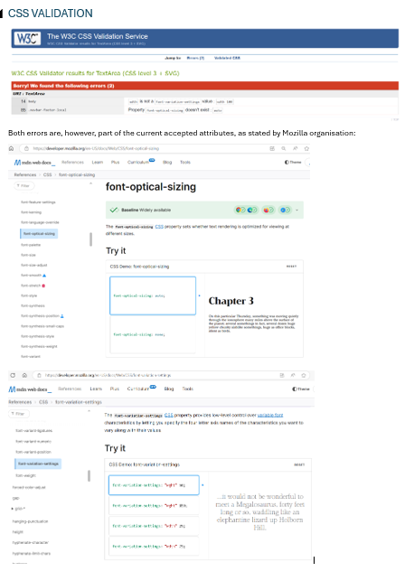

## Accessibility testing

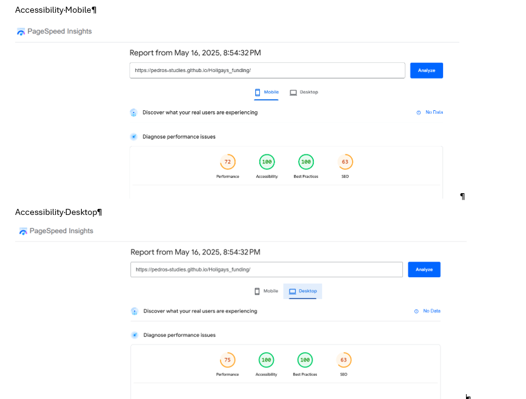

## Viewport testing

### Browser response
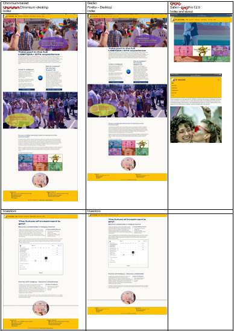
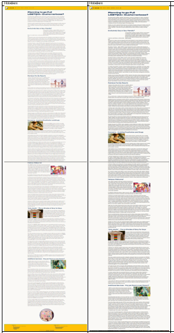
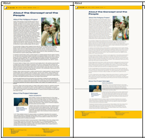

### Handheld devices responsiveness

|Page|Smartphone|Tablet horizontal|Tablet vertical|
|:---|:--------:|:---------------:|:-------------:|
|**INDEX:**  The layout of the Homepage is responsive as expected from the wireframes.  - The hero image is cropped as expected to adjust to the viewport of the device. -The layout of the Mosaic in vertical tablet has been tested exceptionally as of Surface 7 pro in the DevTools.  - The Mosaic adapts in four different breakpoints, as of the BootStrap grid set up.   - The stack menu button in the smallest viewport works as expected. - The footer, also with BootStrap grid, is also responsive as expected  stacking the content in column.| 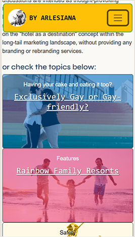 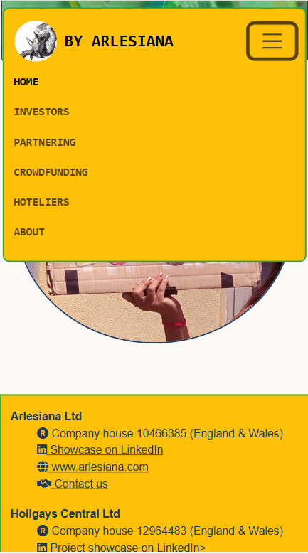  | 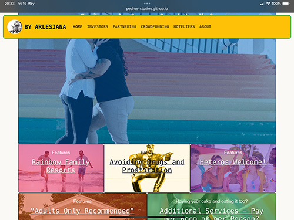|! |
|**INVESTORS:**  The main interactive feature of the page is the cal.com appointment booking feature.  The responsiveness of the feature has been set app by the developers of the widget at the  commercial provider. However, it reacts satisfyingly with all expected breakpoints of the page.| ||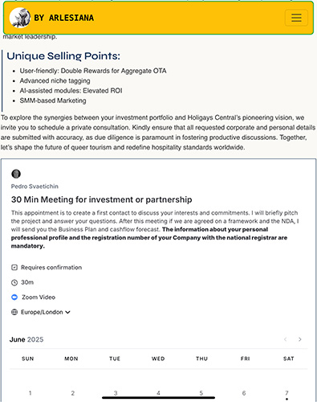|
|**Crowdfunding:**  The page currently only contains one interactive feature:  The "Buy me a coffee" widget. The widget is quite whimsical,  since the commercial promoter has designed it to stick to the  bottom-right corner of the viewport. To have it feature prominently  under the text which refers to it, setting up an iframe containing an  ancillary page - featuring the widget - was necessary.  The setup of the feature in different breakpoints has been the main complication of coding the page.|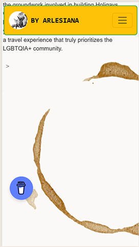|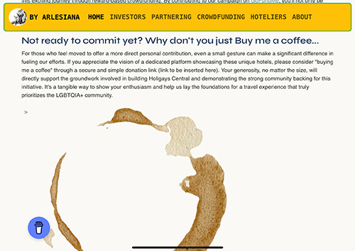|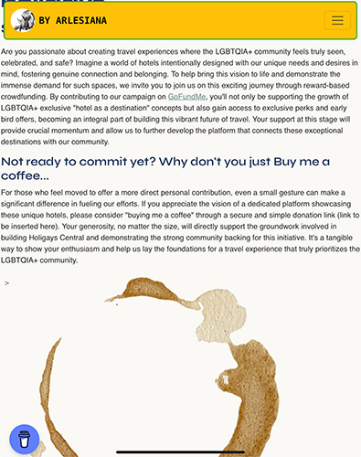|

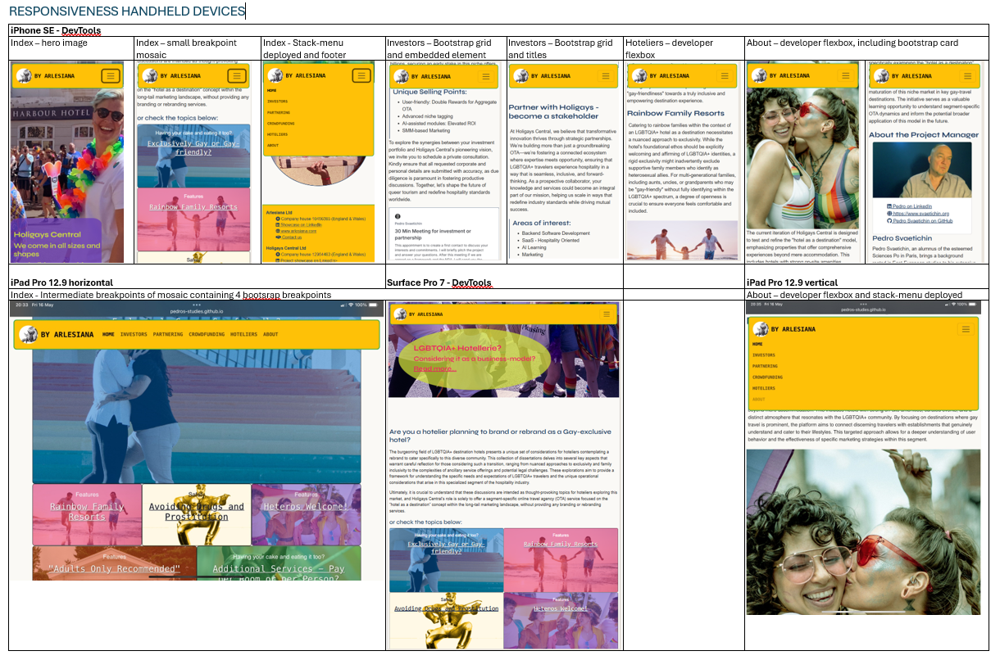

