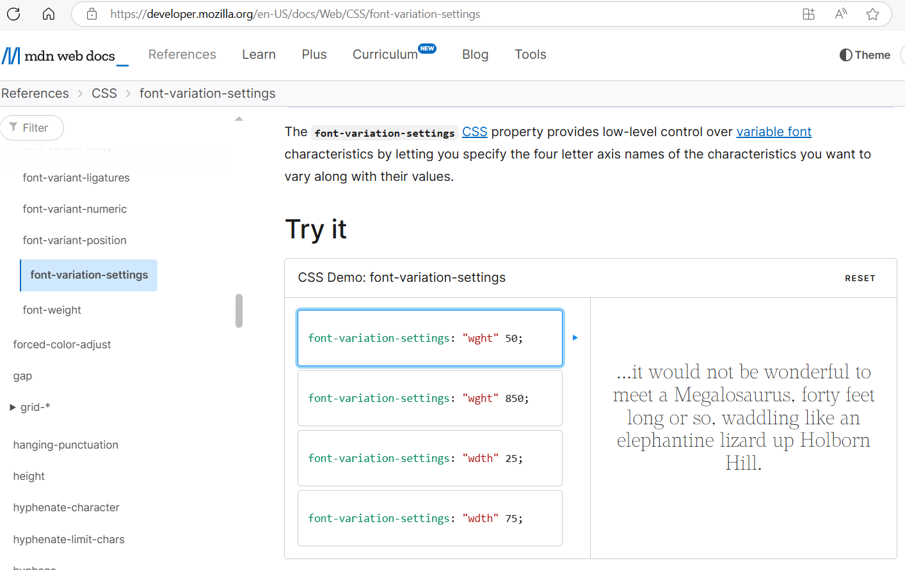
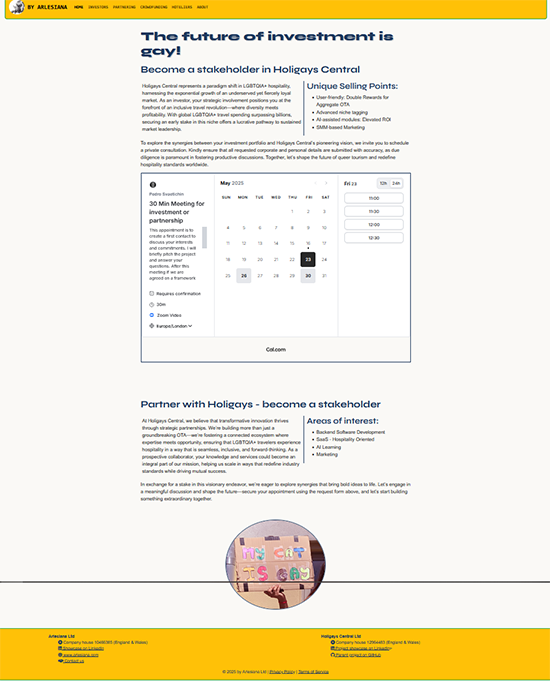

# Testing and accessibility

<!--STart ToC-->
## Table of contents
<ul>
    

        
<a href="#code-testing">Code testing</a>

        <ul>
            <li><a href="#html-validation">HTML validation</a></li>
        </ul>
    

    

        
<a href="#css-testing">CSS testing</a>

        <ul>
            <li><a href="#font-optical-resizing">Font optical resizing</a></li>
            <li><a href="#font-variation-settings">Font variation settings</a></li>
        </ul>
    

    <li><a href="#broken-links">Broken links</a></li>
    

        
<a href="#accessibility-testing">Accessibility testing</a>

        <ul>
            <li><a href="#homepage">Homepage</a></li>
            <li><a href="#investors">Investors</a></li>
            <li><a href="#support">Support</a></li>
            <li><a href="#hoteliers">Hoteliers</a></li>
            <li><a href="#about">About</a></li>
            <li><a href="#404-page">404 page</a></li>
            <li><a href="#unexpected-issues">Unexpected issues in intermediate accessibility testing</a></li>
            <li><a href="#pagespeed-insights">About the other tests of PageSpeed insights</a></li>
        </ul>
    

    

        
<a href="#viewport-testing">Viewport testing</a>

        <ul>
            <li><a href="#desktop-response">Desktop Browser response</a></li>
            <li><a href="#handheld-response">Handheld devices response</a></li>
        </ul>
    

    

        
<a href="#debugging">Debugging</a>

        <ul>
            <li><a href="#known-bugs">Known bugs</a></li>
        </ul>
    

    <li><a href="#ongoing-testing">Ongoing testing</a></li>
</ul>
<!--End of ToC-->

## Code testing

### HTML validation

The W3C html validation didn't find any errors in the code of the website.

## CSS testing

The W3C stubbornly returns two errors regarding font values and properties:

However, these elements don't hinder the proper rendering of the pages and are admissible according to the Mozilla Foundation.

### Font optical resizing

Though W3C css testing doesn't recognise the attribute, the Mozilla foundation recognises it as acceptable, as well as all its values and parameters:

### Font variation settings

Though W3C css testing doesn't recognise the attribute, the Mozilla foundation recognises it as acceptable, as well as all its values and parameters:

## Broken links

The footer on every page contain a deliberate broken link. The purpose of the action is to mislead the possible trolls and haters to believing, that the form on the 404 page is only for the purpose of reporting an issue with a page. However, the form contains options for "contact request" and "General feedback", for the user who might be willing to investigate the feature further. An aria-label informs the users of the website about the purpose of the link and the use of the form.

The second link noted by the validator relates to LinkedIn, which however isn't broken but inaccessible for robots.

## Accessibility testing

All the pages of the website passed the PageSpeed testing for accessibility with 100% of validation.

### Homepage

**Desktop:**

**Mobile:**

### Investors

**Desktop:**

**Mobile:**

### Support

**Desktop:**

**Mobile:**

### Hoteliers

**Desktop:**

**Mobile:**

### About 

**Desktop:**

**Mobile:**

### 404 page

**Desktop:**

**Mobile:**

### Unexpected issues in intermediate accessibility testing

The intermediate HTML testing produced a warning of a possible abusive aria-label in the footer:

The aria-label has been momentarily deleted, but flagged for reinstatement in the future with further testing with WAVE to confirm.

Also to comply with the intermediate testing, it was necessary to replace "disabled" class with BootStrap class "active" of the active navbar link for foreground and background not having enough contrast for accessibility test.

### About the other tests of PageSpeed insights

Though Accessibility and Best practice received top validation, SEO score was kept low for the presence of "noindex" and "nofollow" robots-metatags on all the pages. This is however a provisory situation until further implementation has been done.

The Performance also scored lousy results, especially for handheld devices for the high-quality assets and the presence of 3rd party cookies due to the embedded widgets.

## Viewport testing

The pages have been tested on desktop computers and handheld devices for the viewport responsiveness. Laptops have not been taken in consideration due to the wide range of variables involved which may give unreliable results depending of the device's features, which may render the same result as a desktop computer or a horizontally held tablet. However, the tablet viewport have been tested in both landscape and portrait position

### Desktop Browser response

The rendering of the pages has been tested on the three main browser platforms:
- Chromium (Ungoogled Chromium)
- Gecko (Firefox)
- WebKit (Safari)

|Page|Chromium-based|Gecko-based|WebKit-based|
|----|--------------|-----------|------------|
|**INDEX:**  In full deployment there are no major difference  between the rendering of the Hompage in different browsers. The differences of proportions in these screenshots are due  to the level of zoon needed to get a satisfying screenshot.  The only notable difference in the rendering is the superior quality of the graphics in WebKit based browsers.||||
|**INVESTORS**  The page doesn't show major changes from one rendering platform to the other.||||
|**CROWDFUNDING**  The page doesn't show major changes from one rendering platform to the other.||||
|**HOTELIERS**  The page doesn't show major changes from one rendering platform to the other.||||
|**ABOUT**  The page doesn't show major changes from one rendering platform to the other.||||
|**404**  The page doesn't show major changes from one rendering platform to the other.||||

### Handheld devices response

The site has been tested on standard viewports of handheld devices. For smartphones, the viewport on iPhone SE (with DevTools) was used for being one of the smallest on the market. For tablets, both horizontal and vertical view were tested on iPad Pro 12.9". Exceptionally, for the vertical mosaic feature rendering of the index page was tested on Surface pro 7 (DevTools), to assess the overall layout effect under Windows.

|Page|Smartphone|Tablet horizontal|Tablet vertical|
|:---|:--------:|:---------------:|:-------------:|
|**INDEX:**  The layout of the Homepage is responsive as expected from the wireframes.  - The hero image is cropped as expected to adjust to the viewport of the device. -The layout of the Mosaic in vertical tablet has been tested exceptionally as of Surface 7 pro in the DevTools.  - The Mosaic adapts in four different breakpoints, as of the BootStrap grid set up.   - The stack menu button in the smallest viewport works as expected. - The footer, also with BootStrap grid, is also responsive as expected  stacking the content in column.|    | |! |
|**INVESTORS:**  The main interactive feature of the page is the cal.com appointment booking feature.  The responsiveness of the feature has been set app by the developers of the widget at the  commercial provider. However, it reacts satisfyingly with all expected breakpoints of the page.| |||
|**CROWDFUNDING:**  The page currently only contains one interactive feature: - The "Buy me a coffee" widget.  The widget is quite whimsical, since the commercial promoter has designed it to stick to the bottom-right corner of the viewport. To have it feature prominently  under the text which refers to it, setting up an iframe containing an ancillary page - featuring the widget - was necessary.  The setup of the feature in different breakpoints has been the main complication of coding the page.||||
|**HOTELIERS:**  ||||
|**ABOUT:**  | |||
|**404:**  ||||

## Debugging

### Known bugs

The JavaScript validation code for the "submit button" on 404 page doesn't send the form data to EmailJS as expected. This might however be due to the lack of backend verifcation of the reCAPTCHA code, which would need a backend. Since the requirements for the current project don't require a functioning POST method for the fieldset elements, it might be love's labour lost trying to fix this issue without having all the resources and remedies at hand.

## Ongoing testing

This version is not final or otherwise suitable for end-user testing, to gauge user stories in real life. Some features won't be reliably tested until there can be a backend for the implementation.

Further performance refinements are needed before a release in alpha, including rethinking of the most voluminous assets. However, this would be premature before all the final landing pages of the external links have been set up. 

Accessibility will also be tested with more depth with Lynx as well as with WAVE by AIM.
